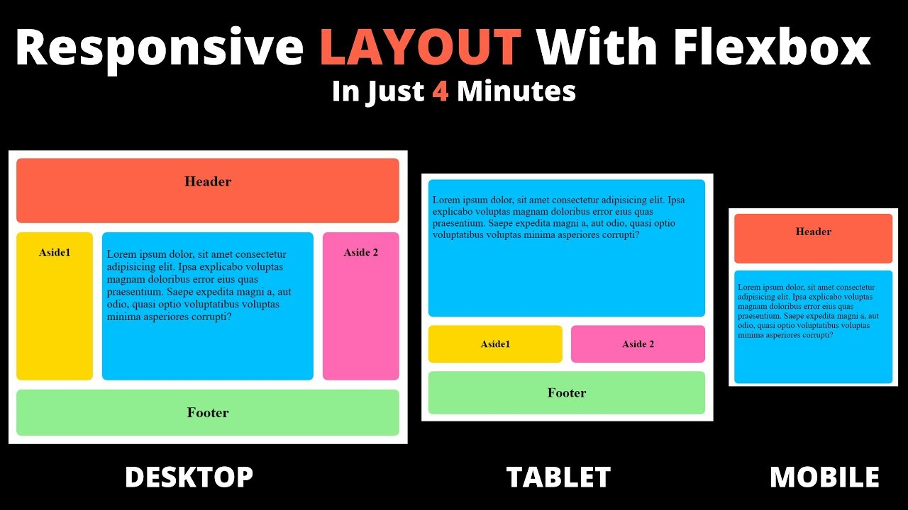

# layout-playground

In this repo im gonna be experimenting with flexbox.



## Observations

1. First of all using flex we always have:

- a flex container
- one or several flex items (the items are obviosly children of the container)

2. When the flex direction is row (the default) the flex items stretch verticly taking the full height of the container (see stretch div page). Thats because by default:

```css
align-items: stretch;
```

### Three related properties

In this section we'll go over the following properties:

- `flex-basis`
- `flex-shrink`
- `flex-grow`

All these properties affect the **cross axis**. That means that if the flex direction is **row** (the default) and there's some space between items, these properties control how each item interacts with that **remaining space**.

1. The `flex-basis` property it's used to stretch the items along the **cross axis** to whatever value we pass (a percentage works really good here in order to distribute any available space).

> If we're using `justify-content: space-between;` in the **flex container**, `flex-basis` will take precedence over it.

2. The `flex-shrink` property will determine how much a **flex item** will shrink, when there's no available space. The higher the value we pass, the more the item will stretch.

> By default `flex-shrink` is equal to 1.

3. If we use `flex-grow : 1;` on an item, it will grow to take all the available space (if any) in the row.

> TODO: explain flex-grow better.

## `flex` shorthand property

The `flex` property (for flex items) is a shorthand for the default values for:

```css
flex-grow: 0;
flex-shrink: 1;
flex-basis: auto;
```

And `flex: 1;` is a shorthand for:

```css
flex-grow: 1;
flex-shrink: 1;
flex-basis: 0;
```
